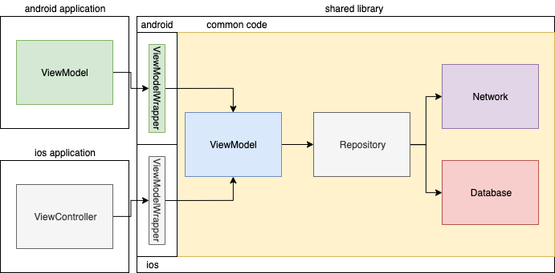

# RadeksMultiplatform

This is a starting project for writing apps with **kotlin-multiplatform** for android/ios.
It utilizes libraries for:

- **ktor-client** for networking
- **kotlin-serialization** for json parsing
- **sqldelight** for database (observable queries)
- **firestoreKmp** for firebase-firestore

Which might be the basic building blocks for fully functional mobile app. And all of these blocks are coordinated with **kotlin-coroutines**.

## Tricky part

Tricky part about this project was to make all these libraries work together. It required to use experimental apis, work-in-progress branches of these libraries and some experimenting with gradle plugins.

I believe this project is a good starting point for experimenting with kotlin-multiplatform for android/ios as all starting difficulties are overcame here so you can focus on writing your app instead of googling why your objects are *frozen* when you use coroutines on iOS.

Using kotlin coroutines version with MultiThread support published by @elizarow (1-3-3-native-mt)
https://github.com/Kotlin/kotlinx.coroutines/issues/462

Workaround for sqlDelight.asFlow:
https://github.com/cashapp/sqldelight/issues/1390

Workaround for making dependencies with transitive dependency on kotlin-coroutines to not override it with older version:
https://stackoverflow.com/questions/59370764/withtimeout-function-gives-illegalstateexception-there-is-no-event-loop-use-ru/59491321#59491321

Integration with firebase-firestore for kotlin-mutliplatform thanks to:
https://github.com/touchlab/FirestoreKMP

## Architecture used:

As you can see I decided to move presentation logic (ViewModels) to common code. Therefore logic implemented on android/ios side is very minimal, it boils down to observing ViewModels and updating UI accordingly to incoming States. 
On Android it is done with LiveData, for iOS is I use normal callbacks implemented with completions.
